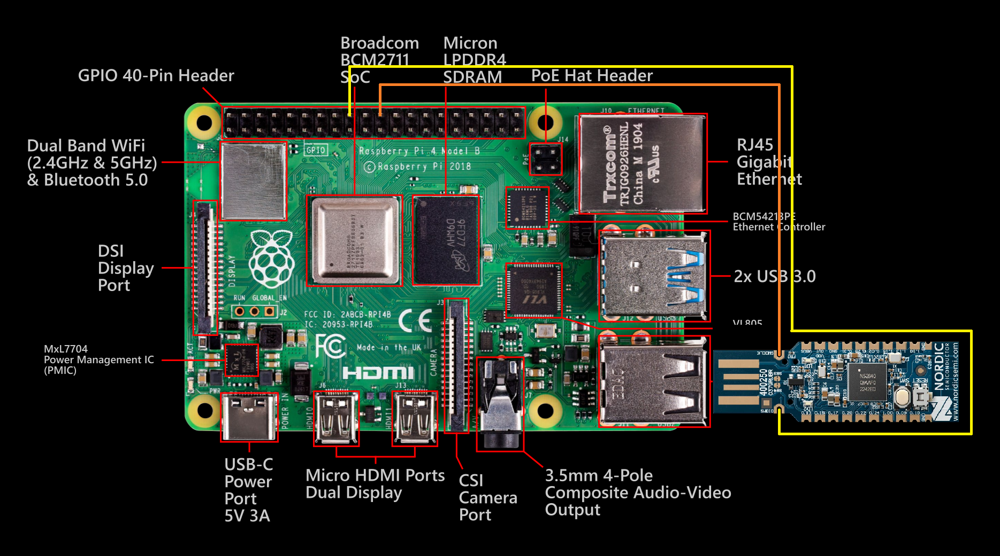

# Automated Installaion of Complete Zephyr RTOS Development Environment on Raspberry Pi

[](https://opensource.org/licenses/MIT)
[](https://zephyrproject.org/)
[](https://www.nordicsemi.com/Products/nRF52840)
[](https://www.raspberrypi.com/)

[](https://www.paypal.com/cgi-bin/webscr?cmd=_s-xclick&hosted_button_id="JVET7MJ54B9DJ")

Cutting-edge automated setup for developing Zephyr RTOS applications hosted on a Raspberry Pi. Nordic's nRF52840 USB dongle is the example hardware running blinky, but Zephyr RTOS development environment supports ~1k boards with endless firmware for embedded application solutions. No soldering, no external probes—just GPIO SWD for initial MCUboot flash and USB DFU for seamless updates. Perfect for BLE/Thread/Mesh prototyping, swarm projects, and scaling for remote development, utilizing ssh extention from your VScode. 




## Features
- **Automated Installation**: One script sets up Zephyr SDK, toolchain, Go/mcumgr, and builds MCUboot + blinky sample.
- **MCUboot Bootloader**: Replaces native Nordic bootloader for secure OTA updates via USB serial (CDC ACM).
- **SWD Flashing via RPi GPIO**: Use bitbang OpenOCD—no extra hardware needed.
- **Multi-Dongle Ready**: Leverage Pi's 4 USB ports for parallel flashing/updates; scale to production volumes.
- **No-Soldering Option**: Pogo pins or clips for SWD pads (as in manual-1.0.2.pdf).
- **Tested on Fresh Bookworm**: From bare OS to blinking RGB LED in minutes.

## Prerequisites
- Raspberry Pi (4/5 recommended) running Debian Bookworm.
- Nordic nRF52840 USB Dongle (PCA10059).
- USB data cable.
- SWD connections: RPi GPIO 24 (SWDIO) → Dongle SWDIO, GPIO 25 (SWCLK) → Dongle SWCLK, GND → GND (optional 3.3V VCC).


## Installation
1. Download and run the setup script:
   ```
   wget https://raw.githubusercontent.com/yourusername/zephyr-nrf-rpi/main/setup-zephyr-dev-1.0.1.sh
   chmod +x setup-zephyr-dev-1.0.1.sh
   sudo ./setup-zephyr-dev-1.0.1.sh
   ```
2. Reboot and log in as `dev` (venv auto-activates).

The script installs everything, builds/flashes MCUboot, and prepares the blinky sample.

## Usage
After setup/reboot:
1. Enter MCUboot recovery: Unplug dongle, hold button (SW1), plug in → `/dev/ttyACM0` appears.
2. Upload blinky:
   ```
   mcumgr --conntype=serial --connstring="dev=/dev/ttyACM0,baud=115200" image upload -e build/blinky/zephyr/zephyr.signed.bin
   mcumgr --conntype=serial --connstring="dev=/dev/ttyACM0,baud=115200" image list
   mcumgr --conntype=serial --connstring="dev=/dev/ttyACM0,baud=115200" image confirm
   mcumgr --conntype=serial --connstring="dev=/dev/ttyACM0,baud=115200" reset
   ```
3. Watch the RGB LED blink!

For custom apps: Build with `-DCONFIG_BOOTLOADER_MCUBOOT=y`, sign, and upload via mcumgr.


## Project Structure
```
├── setup-zephyr-dev-1.0.1.sh  # Main automation script
├── manual-1.0.0.pdf           # Basic env guide
├── manual-1.0.1.pdf           # MCUboot-enhanced guide
├── manual-1.0.2.pdf           # No-soldering version
└── zephyrproject/             # Zephyr workspace (auto-created)
    ├── build-mcuboot/         # MCUboot build
    ├── build/blinky/          # Blinky build
    └── ...                    # Zephyr sources
```
## Bill of Materials
https://www.digikey.com/short/p804r9wf
## Contributing
Fork, PRs welcome! Add multi-dongle batch flashing, mesh samples, or RPi 5 optimizations. Issues for bugs/suggestions.

## License
MIT License. See [LICENSE](LICENSE) for details.

## Acknowledgments
- Zephyr Project for RTOS excellence.
- Nordic Semiconductor for nRF52840.
- Raspberry Pi for the perfect host.

Star if useful—let's build wireless swarms! 🚀
