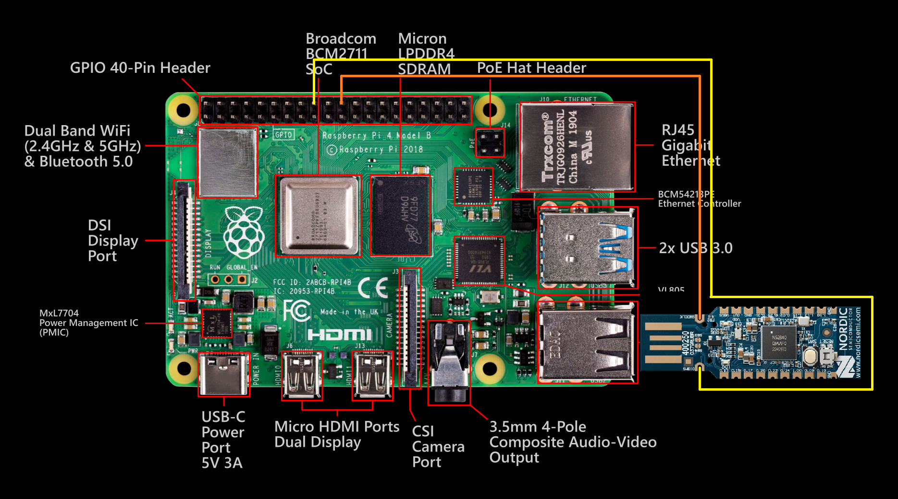

# Complete Zephyr Development from Raspberry Pi

[](https://opensource.org/licenses/MIT)
[](https://zephyrproject.org/)
[](https://www.nordicsemi.com/Products/nRF52840)
[](https://www.raspberrypi.com/)

[](https://www.paypal.com/ncp/payment/JVET7MJ54B9DJ)

Cutting-edge automated setup for developing Zephyr RTOS applications hosted on a Raspberry Pi. Nordic's nRF52840 USB dongle is the example hardware running blinky, however Zephyr RTOS development environment supports ~1k boards with endless firmware for embedded application solutions. No soldering, no external probes—just GPIO SWD for initial MCUboot flash and USB DFU for seamless updates. Perfect for BLE/Thread/Mesh prototyping, swarm projects, and scaling for remote development, utilizing ssh extention from your VScode. 




## Features
- **Automated Installation**: One script sets up Zephyr SDK, toolchain, openOCD, and builds MCUboot + blinky sample.
- **MCUboot Bootloader**: Replaces native Nordic bootloader for secure OTA updates via USB serial (CDC ACM).
- **SWD Flashing via RPi GPIO**: Use bitbang OpenOCD—no extra hardware needed.
- **Multi-Dongle Ready**: Leverage Pi's 4 USB ports for parallel flashing/updates; scale to production volumes.
- **No-Soldering Option**: Pogo pins or clips for SWD pads.
- **Tested on Ubuntu's 24.04 Server OS**: From bare OS to blinking RGB LED in under an hour.

## Prerequisites
- Raspberry Pi 5 running Ubuntu 24.04 Server.
- Nordic nRF52840 USB Dongle (PCA10059).
- SWD connections: RPi GPIO 24 (SWDIO) → Dongle SWDIO, GPIO 25 (SWCLK) → Dongle SWCLK, GND → GND (optional 3.3V VCC).


## Installation
1. Download and run the setup script:
   ```
   wget https://raw.githubusercontent.com/cydrollinger1968/Complete-Zephyr-Development-from-Raspberry-Pi/refs/heads/main/install100.sh
   chmod +x install100.sh
   ./install100.sh
   ```
2. Reboot and log in as `dev`.

The script installs zephyr, and builds MCUboot.

## Project Structure
```
├── install100.sh  # Main automation script
├── └── zephyrproject/             # Zephyr workspace (auto-created)
    ├── build-mcuboot/         # MCUboot build
    ├── build/blinky/          # Blinky build
    └── ...                    # Zephyr sources
```
## Bill of Materials
https://www.digikey.com/short/p804r9wf
## Contributing
Fork, PRs welcome! Add multi-dongle batch flashing, mesh samples, or RPi 5 optimizations. Issues for bugs/suggestions.

## License
MIT License. See [LICENSE](LICENSE) for details.

## Acknowledgments
- xAI Grok for hammering out the script.
- Zephyr Project for RTOS excellence.
- Raspberry Pi for the perfect host.

Star if useful—let's build wireless swarms! 🚀
